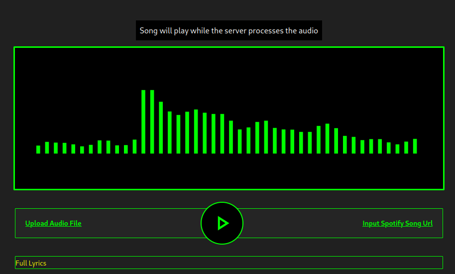

### What is this?

A webApp for singing along and vibing to your favourite song and tracks.

### Things To Do Before Installing

1. Create a `.env` file
2. Create an [azure](https://portal.azure.com) storage account and speech transcription service
3. Supply your `.env` file with the values for `AZURE_SPEECH_KEY`, `AZURE_SPEECH_REGION`, `STORAGE_ACCOUNT_NAME` and `STORAGE_ACCOUNT_KEY`
4. Install [Nim](https://nim-lang.org/install.html) and [Python](https://www.python.org/downloads/)

### How to run

1. Clone this repo
2. Run `./setup.sh` to setup the dependencies and remind you to setup [other stuff](#other-dependencies)
3. Run `nim r server.nim` and go to `http://localhost:2005`

### Other dependencies
There is this weird bug with the azure speech transcription service python SDK that makes it crash if you dont have libopenssl 1.1. So find a way to get libopenssl 1.1 on your operating system before you run this! (This bug cost me 1.5 days!!!)
Also the setup script helped you install [zotify](https://github.com/zotify-dev/zotify), so run `zotify` to supply zotify with your spotify credentials (will be used to download songs from spotify, by pretending to be you).

#### Credits
This project would not be possible without:

- [huggingface gradio spaces](https://huggingface.co/spaces) for giving me a free api to run inference for the mdx-net AI Model.

- [audio-Seperator](https://huggingface.co/spaces/r3gm/Audio_separator) by [r3gm](https://github.com/r3gm) for providing a ready to use huggingface space running inference for the mdx-net AI models.

- [prologue](https://github.com/planety/prologue) was used as server, which saved me a lot of headache on parsing formdata, and avoiding unhandled exceptions crashing the whole server.

- [chronicle](https://github.com/status-im/nim-chronicles) was used for logging stuff on the server-side, to allow me track bugs easily.

- [nim checksums package](https://github.com/nim-lang/checksums) provided me with a sha1 implementation, which I used for identifying songs across browser and server.

- [sqlite](https://www.sqlite.org/) for being a good database :). I used it to temporarily store client updates while a song was being processed. Thanks to [nim-db_connector](https://github.com/nim-lang/db_connector) for wrapping libsqlite3 in a ready to use Nim api.

- [mutagen](https://pypi.org/project/mutagen/) was used for extracting information tags from mp3 and wav audio files.

- [zotify](https://github.com/zotify-dev/zotify) for allowing me obtain music from spotify on the server side.

- [azure web services and sdks](https://portal.azure.com/) for allowing me to use the cloud for free on their student plan.
